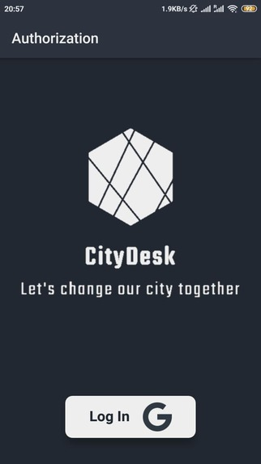
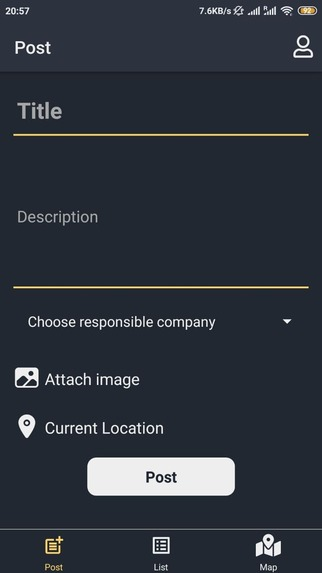
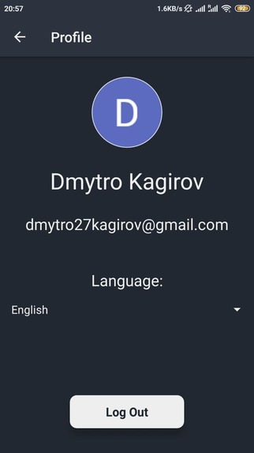
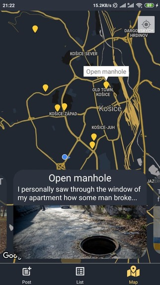
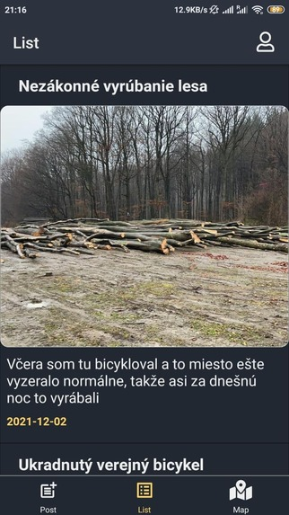

# Fault notification Android application
The application was made as a hackathon project: [Devpost link]( https://devpost.com/software/citydesk)

## Video

## Inspiration
We want to make city better and more comfortable for all it's owners. 

## What it does
It can happen that we encounter broken electrical connections or other breakdowns that go unfixed for several days. Perhaps the company responsible for them doesn’t even know about these incidents.
Thanks to the CityDesk app, we can bring these issues to public attention and expedite their resolution by simply taking a photo, posting it in our app, and marking it on the map.

All posts about breakdowns will be displayed on the map, allowing people to monitor the problem-solving process from their devices.

Additionally, this method of reporting will help identify damage after hurricanes or storms (such as broken trees and bus stops) and provide insight into the scale of the problem.

Furthermore, in the future, it will be possible to add notifications for companies or government departments responsible for various city services, such as transportation, electricity, or roadside maintenance. When people report accidents or breakdowns, these organizations will receive notifications about such issues via email.

  
  
  
  
  

## Authors
- Mozenbakh Anton
- Kagirov Dmytro
- Kashytskyi Oleksandr
- Naumenko Artem
- Tsimbolynets Vitalii

## What's next for CityDesk

- Update main functionality of the project;
- Add global scaling for CityDesk;
- Add new features to interface;
- Find sponsors and run CityDesk globally.

## FOR - people
## WHO - love their city and want to make it better place for living
## THE - CityDesk
## IS - the fault and breakdown notification application
## WHICH - send notifications about breakdowns to responsible structures
## COMPARING - to nothing
## IT - makes the solving of the problem faster, what can even save somebody's LIVE

